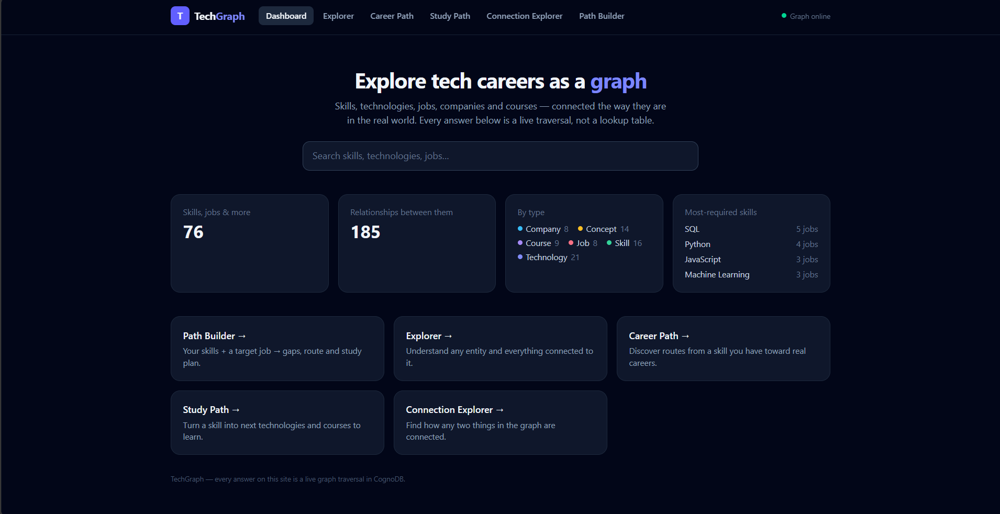
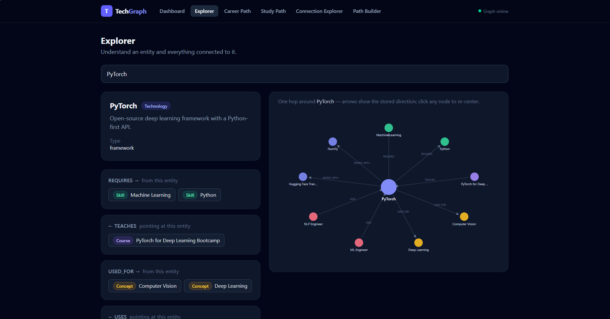
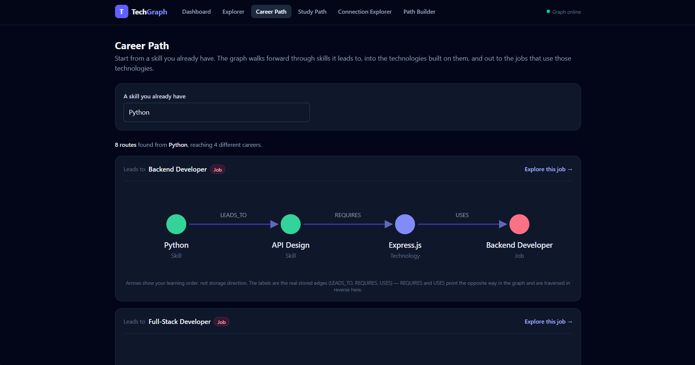
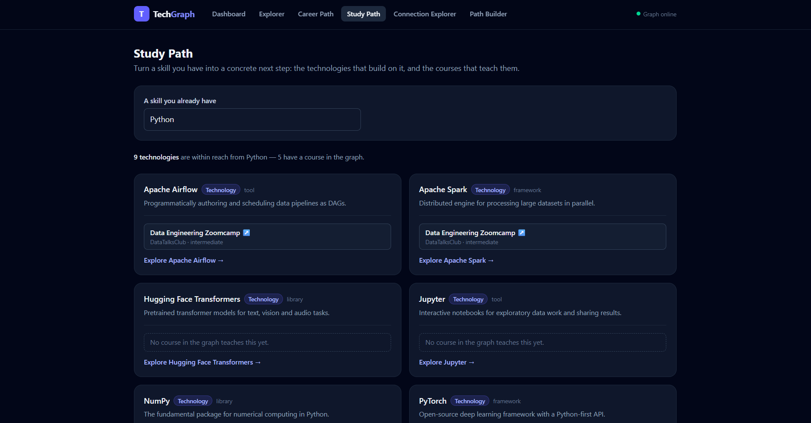
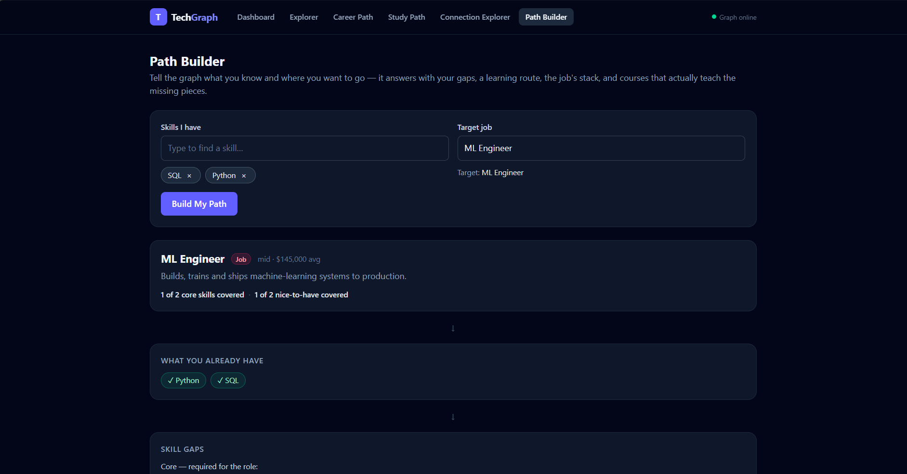
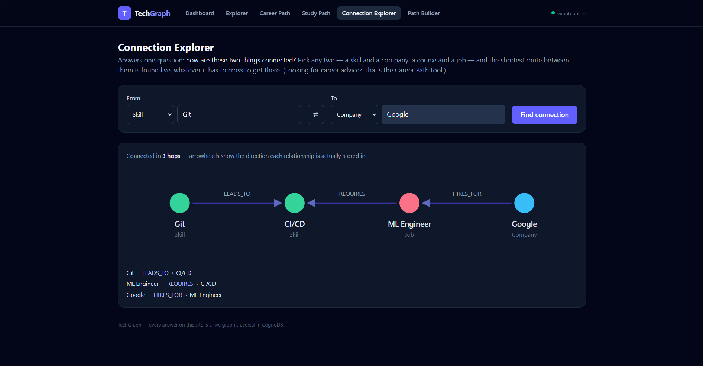
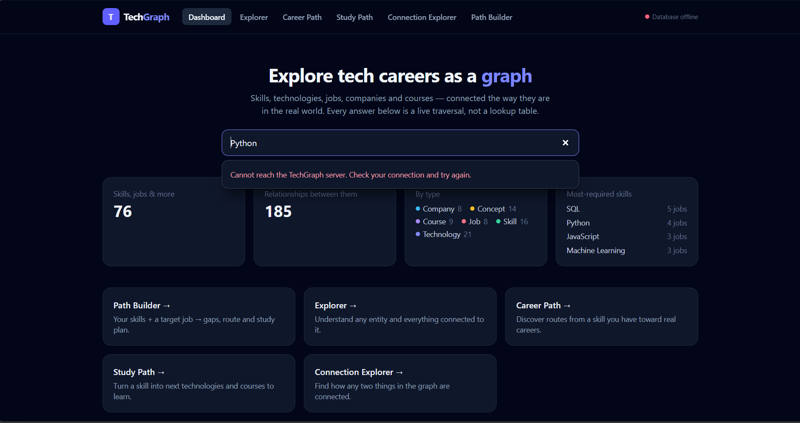

# TechGraph

**An interactive technology relationship and career-path explorer, powered by a graph database.**

TechGraph models skills, technologies, concepts, jobs, companies and courses as a
graph in **CognoDB**, then answers questions that are fundamentally about
*connections* rather than rows.

- 🔗 **Live demo:** <https://techgraph-seven.vercel.app/>
- ⚙️ **Backend API:** <https://techgraph-api.onrender.com/>
- ❤️ **API health:** <https://techgraph-api.onrender.com/api/health>
- 📦 **Repository:** <https://github.com/ArjunGali/techgraph>

> The backend runs on Render's free tier, which sleeps after inactivity — the
> first request after an idle period can take up to ~50 seconds to wake.

---

## Overview

### The problem

Career advice for developers is usually a flat list: "ML Engineers need Python,
machine learning and PyTorch." That tells you the destination but not the route.
The questions people actually ask are relational:

- *I know Python — where can that take me, and through what?*
- *I know Python and SQL and want to be an ML Engineer. What am I missing, in what
  order, and what should I study?*
- *How is Git connected to Google at all?*

Those answers live in the **relationships** between things, not in the things
themselves. TechGraph stores the relationships and computes every answer as a
live traversal.

### Core capabilities

| Capability | What it answers |
|---|---|
| **Explorer** | "What is this, and what is it connected to?" — any entity plus its one-hop neighbourhood, grouped by relationship type and direction. |
| **Career Path** | "Where can this skill take me?" — multi-hop routes from one skill out to real jobs. |
| **Study Path** | "What should I learn next?" — technologies that build on a skill, plus the courses that teach them. |
| **Path Builder** | "I know X and Y, I want job Z — what's missing and how do I get there?" — gap analysis, learning routes, the role's stack, and courses. |
| **Connection Explorer** | "How are these two things connected?" — shortest path between any two entities, whatever types it has to cross. |

Nothing is precomputed, hard-coded, or stored back into the database. The graph is
the single source of truth.

---

## Why a graph database?

Relational databases *can* represent this data perfectly well — six tables and
eight join tables would do it, and for fixed-shape questions ("which jobs require
Python?") SQL is excellent. The argument for a graph here is not capability, it is
**naturalness and maintainability for traversal-shaped questions**: ones whose
depth is unknown in advance and whose path crosses many different relationship
types.

Five concrete examples from this codebase:

### 1. Multi-hop career discovery (unknown-depth traversal)

```cypher
MATCH path = (s:Skill {name: $skill})-[:LEADS_TO*1..2]->(:Skill)
             <-[:REQUIRES]-(:Technology)<-[:USES]-(j:Job)
RETURN path
```

`[:LEADS_TO*1..2]` means "follow one or two `LEADS_TO` hops" — the traversal
depth is a parameter of the pattern, not of the query's structure. In SQL, one hop
and two hops are *different queries* (an extra self-join each time), so supporting
"1 to 4 hops" means either four unioned queries or a recursive CTE with manual
depth tracking. Here it is two characters.

### 2. Skill → technology → job (crossing relationship types mid-path)

The same query above crosses three different relationship types (`LEADS_TO`,
`REQUIRES`, `USES`) and three node labels in one pattern, and traverses two of
those edges *against* their stored direction. In SQL each hop is a join against a
differently-shaped junction table, and reading the query no longer tells you the
shape of the journey. In Cypher the query literally draws it.

### 3. Shared-purpose technology discovery (common-neighbour pattern)

```cypher
MATCH (t:Technology {name: $technology})-[:USED_FOR]->(c:Concept)<-[:USED_FOR]-(other:Technology)
RETURN other.name AS technology, collect(c.name) AS sharedPurposes
```

"Which technologies serve the same purpose as PyTorch?" is a self-join through a
junction table in SQL — routine, but the query's meaning is buried in aliases
(`t1`, `t2`, `uf1`, `uf2`). The graph version reads as the question itself: two
technologies pointing at the same concept.

> ⚠️ TechGraph reports these as **related technologies**, never as
> "alternatives" or "substitutes" — sharing a purpose is evidence of relatedness,
> not proof one can replace the other.

### 4. Relationship properties: `REQUIRES.level`

```cypher
MATCH (s:Skill {name: $skill})<-[r:REQUIRES]-(j:Job)<-[:HIRES_FOR]-(co:Company)
WHERE r.level = $level
RETURN co.name AS company, collect(DISTINCT j.name) AS jobs
```

Python is a **core** requirement for an ML Engineer but only **nice-to-have** for
a Frontend Developer. That fact belongs to the *pair*, not to either node — so it
lives on the edge. This maps exactly onto a column on a relational join table; the
graph advantage is that the edge is a first-class object you can filter **in the
middle of a traversal** without breaking the pattern apart.

### 5. Shortest connection path (the awkward one)

```cypher
MATCH (a) WHERE $fromLabel IN labels(a) AND a.name = $fromName
MATCH (b) WHERE $toLabel  IN labels(b) AND b.name = $toName
MATCH p = shortestPath((a)-[*..6]-(b))
RETURN p
```

*"How is the skill Git connected to the company Google?"* The answer turns out to
be `Git → CI/CD → ML Engineer → Google`, but nobody knew in advance that it would
be three hops, or that it would pass through a skill, a job and a company using
three different relationship types.

To express this relationally you need a recursive CTE that unions across every
join table at every level, carries a visited-set to prevent cycles, tracks depth
to stop, and reconstructs the path afterwards — typically 40+ lines that must be
edited whenever a new relationship type is added. The Cypher is four lines and
does not change when the schema grows.

**Summary:** relational modelling stays clean while the questions have a fixed
shape. TechGraph's questions do not, so the graph keeps the queries short, the
schema additive, and the intent readable.

---

## Architecture

```
┌──────────────────────┐
│  React + Vite +      │   Pages, SVG visualisations, all UI state.
│  Tailwind CSS        │   Never sees credentials; only calls the REST API.
│  (Vercel)            │
└──────────┬───────────┘
           │  HTTPS · JSON  (fetch, /api/*)
           ▼
┌──────────────────────┐
│  Express.js (Node)   │   routes → controllers → services → queries
│  (Render)            │   Validation, HTTP shaping, error mapping.
└──────────┬───────────┘
           │  neo4j-driver (official JavaScript driver)
           ▼
┌──────────────────────┐
│  Bolt protocol       │   Encrypted binary protocol (bolt+s://)
└──────────┬───────────┘
           ▼
┌──────────────────────┐
│  CognoDB             │   openCypher graph database — the source of truth.
└──────────────────────┘
```

### Layer responsibilities

| Layer | Responsibility | Does **not** |
|---|---|---|
| `client/src/pages` | Page composition, user flow | Compute graph answers |
| `client/src/services/api.js` | Every HTTP call, URL encoding, error normalisation | Know about Cypher |
| `server/routes` | Map URL → controller | Contain logic |
| `server/controllers` | Read request input, shape the JSON response | Contain Cypher |
| `server/services` | Validate, run queries, map driver records → plain JSON | Hold sessions open |
| `server/queries` | Parameterised Cypher strings, one module per capability | Touch the network |
| `server/config/db.js` | Driver singleton, session lifecycle, connectivity check | Know about HTTP |

**Session handling:** one driver instance for the process (drivers are expensive,
sessions are cheap). Every query opens a short-lived session, runs inside
`executeRead` (driver-managed retries), and closes it in a `finally` block.

**Security:** credentials exist only in `server/.env` (git-ignored) and in the
hosting platform's environment settings. The browser never receives them, and
database errors are logged server-side while clients get generic messages.

---

## Data model

Six node labels and seven relationship types, in eight patterns.
Full rationale, property tables and worked traversals: **[docs/DATA_MODEL.md](docs/DATA_MODEL.md)**.

```
                            LEADS_TO
                           ┌────────┐
                           ▼        │
                       ┌───┴────┐
        ┌────────────► │ Skill  │ ◄─────────────┐
        │   REQUIRES   └────────┘               │  REQUIRES
        │   (tech needs    ▲                    │  {level: core |
        │    this skill)   │ TEACHES            │   nice-to-have}
        │                  │                    │
 ┌──────┴───────┐      ┌───┴────┐           ┌───┴────┐   HIRES_FOR   ┌─────────┐
 │  Technology  │ ◄────┤ Course │           │  Job   │ ◄─────────────┤ Company │
 └──────────────┘ TEACHES──────┘            └────────┘               └─────────┘
    │    ▲  │  ▲                                │
    │    └──┘  └────────────── USES ────────────┘
    │   WORKS_WITH
    │   (tech ↔ tech, symmetric)
    ▼ USED_FOR
 ┌─────────┐
 │ Concept │
 └─────────┘
```

### Nodes

| Label | Properties | Count |
|---|---|---|
| `Skill` | `name`, `description`, `category`, `difficulty` | 16 |
| `Technology` | `name`, `description`, `type` | 21 |
| `Concept` | `name`, `description`, `field` | 14 |
| `Job` | `name`, `description`, `level`, `avgSalaryUSD` | 8 |
| `Company` | `name`, `description`, `industry` | 8 |
| `Course` | `name`, `description`, `provider`, `url`, `level` | 9 |
| | | **76** |

### Relationships

| Pattern | Meaning | Properties | Count |
|---|---|---|---|
| `(:Skill)-[:LEADS_TO]->(:Skill)` | Learning A progresses toward B | — | 15 |
| `(:Technology)-[:REQUIRES]->(:Skill)` | Using this tech presupposes this skill | — | 29 |
| `(:Technology)-[:WORKS_WITH]->(:Technology)` | Commonly used together (symmetric) | — | 16 |
| `(:Technology)-[:USED_FOR]->(:Concept)` | The tech exists to enable this concept | — | 25 |
| `(:Job)-[:REQUIRES]->(:Skill)` | The role asks for this skill | `level` | 33 |
| `(:Job)-[:USES]->(:Technology)` | Part of the role's day-to-day stack | — | 28 |
| `(:Company)-[:HIRES_FOR]->(:Job)` | This company hires this role | — | 21 |
| `(:Course)-[:TEACHES]->(:Technology\|:Skill)` | Curriculum coverage | — | 18 |
| | | | **185** |

Two modelling decisions worth stating explicitly:

- **Languages are `Skill`s; frameworks and tools are `Technology`s.** People *know*
  Python; stacks *use* PyTorch. This keeps skill→job traversals meaningful.
- **`Technology -[:REQUIRES]-> Skill`, not `Skill -[:WORKS_WITH]-> Technology`.**
  The real-world fact is that PyTorch presupposes Python, not that Python "works
  with" PyTorch. Modelling it in the true direction reuses the existing `REQUIRES`
  vocabulary and keeps `WORKS_WITH` purely symmetric.

### Seed data

Hand-curated in `server/seed/data.js`. Every edge is a statement a practitioner
would actually make; none exist merely to make a demo traversal possible.

> Company `HIRES_FOR` edges use real company names (Google, Microsoft, NVIDIA,
> Netflix, Spotify, Amazon, Shopify, Airbnb) as **realistic demo data**
> illustrating the kinds of roles such companies hire for. They are not claims
> about current job openings.

---

## Main queries

All Cypher is parameterised (`$skill`, `$job`, `$fromLabel`, …) and lives in
`server/queries/`. Cypher is never built by string concatenation.

### T1 — Career discovery (the multi-hop showcase)

`server/queries/career.queries.js` → `GET /api/career-path?skill=Python`

```cypher
MATCH path = (s:Skill {name: $skill})-[:LEADS_TO*1..2]->(:Skill)
             <-[:REQUIRES]-(:Technology)<-[:USES]-(j:Job)
RETURN [n IN nodes(path) | {label: labels(n)[0], name: n.name}] AS steps,
       [r IN relationships(path) | type(r)] AS relationshipTypes,
       j.name AS job
ORDER BY length(path), job
LIMIT 10
```

**In plain English:** start at a skill; follow one or two "leads to" arrows into
skills it naturally progresses toward; step *backwards* along a `REQUIRES` arrow
onto technologies that build on those skills; step backwards again along `USES` to
the jobs that use those technologies daily.

With `$skill = "Python"` the graph discovers 8 routes to 4 different careers,
including the assignment's example journey:

```
Python → Machine Learning → PyTorch → ML Engineer
```

3 hops across 3 node labels using 3 relationship types — **discovered, not
hard-coded**. The UI renders it in learning order and states plainly that two
arrows are traversed against their stored direction.

### T3 — Technologies sharing a common purpose

`GET /api/technologies/PyTorch/related`

```cypher
MATCH (t:Technology {name: $technology})-[:USED_FOR]->(c:Concept)<-[:USED_FOR]-(other:Technology)
RETURN other.name AS technology, collect(c.name) AS sharedPurposes
ORDER BY size(sharedPurposes) DESC, technology ASC
```

**In plain English:** find the purposes this technology serves, then find the other
technologies serving those same purposes — and report *which* purposes they share,
so the UI can explain why they are related. PyTorch shares *Deep Learning* and
*Computer Vision* with TensorFlow.

### T4 — Employers, filtered on a relationship property

`GET /api/employers-for-skill?skill=Python&level=core`

```cypher
MATCH (s:Skill {name: $skill})<-[r:REQUIRES]-(j:Job)<-[:HIRES_FOR]-(co:Company)
WHERE r.level = $level
RETURN co.name AS company, co.industry AS industry, collect(DISTINCT j.name) AS jobs
ORDER BY company
```

**In plain English:** walk from a skill to the jobs that require it — but only
across edges whose `level` matches — then on to the companies hiring those roles.
The filter happens *on the relationship, mid-traversal*.

### T5 — Shortest connection path

`GET /api/connection-path?fromLabel=Skill&fromName=Git&toLabel=Company&toName=Google`

```cypher
MATCH (a) WHERE $fromLabel IN labels(a) AND a.name = $fromName
MATCH (b) WHERE $toLabel  IN labels(b) AND b.name = $toName
MATCH p = shortestPath((a)-[*..6]-(b))
RETURN [n IN nodes(p) | {label: labels(n)[0], name: n.name, description: n.description}] AS nodes,
       [r IN relationships(p) | {type: type(r), from: startNode(r).name, to: endNode(r).name}] AS relationships
```

**In plain English:** pin both endpoints by their unambiguous `(label, name)` pair,
then find the fewest edges connecting them — any relationship types, any
direction, up to six hops. Each edge is returned with its stored `from`/`to` so
the UI can draw truthful arrow directions.

> Cypher cannot put a parameter in a label position, so `$label IN labels(n)` is
> the fully-parameterised way to pin a label. Endpoints are never matched by name
> alone, which could be ambiguous across labels.

### Path Builder — four composed queries

`GET /api/career-builder?skills=Python&skills=SQL&job=ML+Engineer`

Deliberately **not** one large query. Four focused ones, each answerable in a
sentence, composed in `server/services/builder.service.js`:

| # | Query | Question it answers |
|---|---|---|
| Q1 | `JOB_REQUIREMENTS_COVERAGE` | "What does this job require, at what level, and which do I already have?" |
| Q2 | `LEARNING_ROUTES` | "For each missing **core** skill, what's the shortest `LEADS_TO` chain from a skill I have?" |
| Q3 | `JOB_TECHNOLOGIES` | "What's the role's stack, what does each technology presuppose, and what teaches it?" |
| Q4 | `GAP_SKILL_COURSES` | "Which courses `TEACHES` my missing skills?" |

```cypher
-- Q1: requirements and coverage in one pass. The entire gap analysis is this
-- result partitioned by (level, covered) — explainable counts, never a score.
MATCH (j:Job {name: $job})-[r:REQUIRES]->(s:Skill)
RETURN s.name AS skill, r.level AS level, s.name IN $skills AS covered
ORDER BY r.level, s.name
```

```cypher
-- Q2: shortest learning chain from ANY skill the user has to each core gap.
MATCH (have:Skill) WHERE have.name IN $skills
MATCH (gap:Skill)  WHERE gap.name  IN $gapSkills
MATCH p = shortestPath((have)-[:LEADS_TO*1..4]->(gap))
WITH gap, p ORDER BY length(p) ASC
WITH gap, collect(p)[0] AS best
RETURN gap.name AS skill, [n IN nodes(best) | n.name] AS route
```

A gap with no route is an honest result, not an error — the UI says "start
learning it directly" rather than inventing a path. Likewise, a missing skill with
no course shows an explicit empty state rather than a fabricated recommendation.

**Worked example** — `skills=Python,SQL`, `job=ML Engineer`:

```
Coverage      1 of 2 core skills covered · 1 of 2 nice-to-have covered
Have          ✓ Python (core)   ✓ SQL (nice-to-have)
Core gap      Machine Learning
Nice gap      CI/CD
Route         Python → Machine Learning → ML Engineer
Stack         PyTorch, scikit-learn, Docker, AWS  (each labelled with what it still needs)
Courses       Machine Learning Specialization, Deep Learning Specialization, …
              CI/CD → no course in the graph teaches this yet
```

---

## API

All endpoints are read-only `GET`s returning JSON. Errors return
`{ "error": "human-readable message" }` — never a stack trace.

| Endpoint | Capability |
|---|---|
| `/api/live` | Liveness only — always 200 while the process is serving; performs no database call. Used by the platform health check |
| `/api/health` | Liveness + database connectivity (`connected` / `not_configured` / `unreachable`); 503 when the database is unreachable |
| `/api/search?q=py` | Case-insensitive entity search across all labels |
| `/api/stats` | Dashboard statistics (live counts, most-required skills) |
| `/api/entities/:label/:name` | Entity lookup by unambiguous (label, name) |
| `/api/entities/:label/:name/relationships` | One-hop neighbourhood, grouped by type + direction |
| `/api/jobs/requiring/:skill` | Jobs requiring a skill, with `core` / `nice-to-have` |
| `/api/technologies/:name/related` | Related technologies: used-together + shared purpose |
| `/api/career-path?skill=Python` | T1 multi-hop career discovery |
| `/api/study-path?skill=Python` | T2 reachable technologies + courses |
| `/api/employers-for-skill?skill=Python&level=core` | T4 employers, filtered on the edge property |
| `/api/career-builder?skills=Python&skills=SQL&job=ML%20Engineer` | Path Builder: gaps, routes, stack, courses |
| `/api/connection-path?fromLabel=…&fromName=…&toLabel=…&toName=…` | T5 shortest path; `{ "path": null }` when none |

**Status codes:** `400` invalid input · `404` unknown entity or route · `503`
database unavailable · `500` unexpected failure. "No path found" and "no search
results" are `200`s with explicit empty values — they are valid outcomes, not
errors.

---

## Setup

### Prerequisites

- **Node.js ≥ 20.19** (developed on 24.19 LTS) — <https://nodejs.org>
- **A CognoDB instance.** CognoDB implements openCypher over the Bolt protocol and
  works with the official Neo4j drivers; this project uses
  [`neo4j-driver`](https://www.npmjs.com/package/neo4j-driver). Create an instance
  in your CognoDB environment and copy its connection URI, username and password.

### 1. Backend

```bash
cd server
npm install
cp .env.example .env        # then fill in your CognoDB credentials
npm run seed                # ⚠ RESETS the database, then loads 76 nodes / 185 relationships
npm run dev                 # API on http://localhost:4000
```

`npm run seed` is idempotent: it creates uniqueness constraints, deletes all
existing data, loads the dataset, and verifies the created counts against the
database. Run `node seed/seed.js --validate-only` to check the dataset's
referential integrity without touching any database.

### 2. Frontend

In a second terminal:

```bash
cd client
npm install
npm run dev                 # UI on http://localhost:5173
```

The Vite dev server proxies `/api` to `http://localhost:4000`, so no CORS
configuration or hard-coded API host is needed in development.

### 3. Tests

```bash
cd server
npm run test:queries        # 14 checks: query layer against the live database
npm run test:api            # 31 checks: every endpoint over HTTP, incl. failure modes

# Run the same API assertions against a deployed backend:
API_BASE_URL=https://your-api.onrender.com npm run test:api
```

```bash
cd client
npm run build               # production build
```

---

## Environment variables

**Never commit real credentials.** `server/.env` is git-ignored; only
`server/.env.example` (with placeholders) is tracked. In production these are set
in the hosting platform's dashboard, never in the repository.

### Backend (`server/.env`, and Render environment settings)

| Variable | Required | Purpose |
|---|---|---|
| `COGNODB_URI` | ✅ | Bolt connection URI, e.g. `bolt+s://<host>` (TLS) or `bolt://<host>:7687` |
| `COGNODB_USERNAME` | ✅ | Database username |
| `COGNODB_PASSWORD` | ✅ | Database password |
| `CLIENT_ORIGIN` | Production | Deployed frontend origin (e.g. `https://techgraph.vercel.app`). Restricts CORS; defaults to `*` in local development |
| `PORT` | — | HTTP port (default `4000`; Render sets this automatically) |

### Frontend (Vercel environment settings)

| Variable | Required | Purpose |
|---|---|---|
| `VITE_API_URL` | Production | Deployed backend base URL (e.g. `https://techgraph-api.onrender.com`). Left unset in development so the Vite proxy is used |

---

## Testing

| Suite | Command | Result |
|---|---|---|
| Query layer (live database) | `npm run test:queries` | **14 passed, 0 failed** |
| REST API (over HTTP) | `npm run test:api` | **33 passed, 0 failed** |
| Frontend production build | `npm run build` | ✅ 272 kB JS / 84.6 kB gzip |
| Health check | `curl localhost:4000/api/health` | `{"status":"ok","service":"techgraph-api","database":"connected"}` |

The API suite covers happy paths, empty results, invalid input (`400`), unknown
entities (`404`), all seven Path Builder scenarios, and **database-unavailable
behaviour (`503`)** — the last simulated by spawning a second server pointed at a
dead database URI, so the real instance is never disturbed.

---

## Screenshots

| View | Image |
|---|---|
| Dashboard |  |
| Explorer + SVG neighbourhood |  |
| Career Path |  |
| Study Path |  |
| Path Builder |  |
| Connection Explorer |  |
| Database-unavailable state |  |

---

## Project structure

```
techgraph/
├── client/                       # React + Vite + Tailwind SPA → Vercel
│   ├── src/
│   │   ├── components/           # Badge, States, SearchBox, EntityPicker,
│   │   │                         #   NeighborhoodGraph & PathDiagram (hand-rolled SVG)
│   │   ├── pages/                # Dashboard, Explorer, CareerPath, StudyPath,
│   │   │                         #   PathBuilder, Connection
│   │   ├── services/api.js       # every HTTP call, in one place
│   │   ├── hooks/useApi.js       # loading / error / retry state
│   │   └── utils/labels.js       # per-label colour identity
│   └── vercel.json               # SPA rewrite so deep links survive refresh
├── server/                       # Express REST API → Render
│   ├── config/db.js              # driver singleton, sessions, connectivity check
│   ├── routes/                   # URL → controller
│   ├── controllers/              # input validation, HTTP shaping
│   ├── services/                 # query execution, record → JSON, typed errors
│   ├── queries/                  # all parameterised Cypher
│   ├── seed/                     # dataset + idempotent seed script
│   ├── middleware/errors.js      # central error handler
│   └── scripts/                  # repeatable query & API test suites
├── docs/DATA_MODEL.md            # full schema, rationale, worked traversals
├── render.yaml                   # backend blueprint (no secrets)
└── .gitignore                    # includes .env
```

**Dependencies are deliberately minimal:** `express`, `cors`, `dotenv` and
`neo4j-driver` on the server; `react`, `react-dom` and `react-router-dom` on the
client. Both graph visualisations are hand-rolled SVG (~150 lines each) with
deterministic layouts rather than a physics/graph-rendering library — small enough
to read, explain and defend.

---

## Deployment

### Backend → Render

| Setting | Value |
|---|---|
| Root directory | `server` |
| Build command | `npm install` |
| Start command | `npm start` |
| Health check path | `/api/live` |
| Environment | `COGNODB_URI`, `COGNODB_USERNAME`, `COGNODB_PASSWORD`, `CLIENT_ORIGIN` |

`render.yaml` in the repository root describes this as a blueprint; every secret is
marked `sync: false` so Render prompts for it rather than reading it from the repo.

> On Render's free tier the service sleeps after inactivity; the first request
> afterwards can take ~50 seconds to cold-start.

### Frontend → Vercel

| Setting | Value |
|---|---|
| Root directory | `client` |
| Framework preset | Vite |
| Environment | `VITE_API_URL` = the Render backend URL |

`client/vercel.json` supplies the SPA rewrite so deep links such as
`/explorer/Skill/Python` survive a browser refresh instead of 404-ing.

After both are live, set `CLIENT_ORIGIN` on Render to the Vercel URL so CORS is
restricted to your own frontend.
